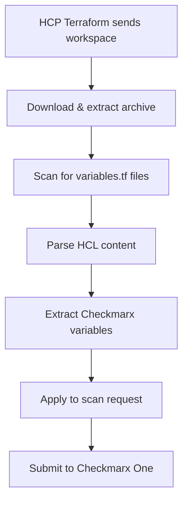

# Configuration Reference

This document provides comprehensive configuration options for the HCP Checkmarx Listener, including dynamic#### Error Handling

| Scenario | Behavior |
|----------|----------|
| No variables.tf found | Use service defaults |
| Invalid HCL syntax | Log warning, use service defaults |
| Variable without default | Ignore variable, use service defaults |
| Non-string default value | Ignore variable, use service defaults |
| Network/file errors | Log error, use service defaults |
| Empty group name | Auto-assign default group "hcp-tasks" |
| Archive extraction failure | Log error, use service defaults |

#### Troubleshooting

**Common Issues:**

1. **Archive Extraction Errors**
   ```
   Error parsing CxOne config from Terraform, using defaults: failed to extract tar.gz
   ```
   - Ensure the downloaded file is a valid tar.gz archive
   - Check file permissions and available disk space

2. **Empty Group Name**
   ```
   Failed to create group : HTTP 400 Bad Request: Group name is missing
   ```
   - The service now automatically assigns "hcp-tasks" as default group
   - Ensure `checkmarx_group` variable has a non-empty default value

3. **Variables Not Found**
   ```
   Using CxOne configuration - Project: default-project, Group: hcp-tasks, Branch: main
   ```
   - Check that variables.tf file exists in the workspace
   - Verify variable names are exactly: `checkmarx_project_name`, `checkmarx_group`, `checkmarx_branch`
   - Ensure variables have `default` values definedm variable parsing.

## Table of Contents

- [Service Configuration](#service-configuration)
- [Terraform Variables.tf Integration](#terraform-variablestf-integration)
- [Environment Variables](#environment-variables)
- [Configuration Files](#configuration-files)
- [Examples](#examples)

## Service Configuration

### Basic Configuration

The service supports multiple configuration sources with the following precedence:

1. **Command line flags** (highest priority)
2. **Environment variables**
3. **Configuration file**
4. **Built-in defaults** (lowest priority)

### Configuration File (config.yaml)

```yaml
# Server Configuration
port: "8080"
host: "0.0.0.0"
timeout: "60s"

# Checkmarx One Configuration
checkmarx:
  base_url: "https://ast.checkmarx.net"
  auth_url: "https://iam.checkmarx.net"
  region: "US"
  project_id: "default-project"
  api_key: "${CHECKMARX_API_KEY}"
  use_oauth: false
  client_id: "${CHECKMARX_CLIENT_ID}"
  client_secret: "${CHECKMARX_CLIENT_SECRET}"

# Policy Configuration
policy:
  enabled: true
  break_on_violation: true
  severity_threshold: "HIGH"

# Worker Configuration
workers:
  max_workers: 5
  queue_size: 100
  job_timeout: "600s"

# Logging Configuration
logging:
  level: "info"
  format: "json"
  output: "stdout"

# Security Configuration
security:
  hmac_secret: "${HMAC_SECRET}"
  enable_request_validation: true
  allowed_origins: []

# Proxy Configuration (optional)
proxy:
  url: "${HTTPS_PROXY}"
  username: "${PROXY_USERNAME}"
  password: "${PROXY_PASSWORD}"
```

## Terraform Variables.tf Integration

### Overview

The service automatically parses Terraform configuration files to extract Checkmarx One scan parameters. This allows users to customize scans per workspace without modifying the service configuration.

### Supported Variables

The service looks for these specific variables in `variables.tf` files:

| Variable Name | Purpose | Type | Required |
|---------------|---------|------|----------|
| `checkmarx_project_name` | Checkmarx One project name | string | No |
| `checkmarx_group` | Checkmarx One group/team | string | No |
| `checkmarx_branch` | Branch name for scan context | string | No |

### Variable Declaration Format

The parser supports standard Terraform variable declarations:

```hcl
variable "checkmarx_project_name" {
  description = "The name of the Checkmarx One project"
  type        = string
  default     = "my-project"
  
  validation {
    condition     = length(var.checkmarx_project_name) > 0
    error_message = "Project name cannot be empty."
  }
}
```

### Parsing Logic

1. **File Discovery**: Service scans all files named `variables.tf` in the workspace
2. **Variable Extraction**: Parses HCL syntax to find variable blocks
3. **Default Value Extraction**: Retrieves the `default` value from each variable
4. **Type Validation**: Ensures values are strings (other types ignored)
5. **Fallback Handling**: Uses service defaults if variables not found

### Processing Flow



### Configuration Precedence

The service uses the following precedence for scan parameters:

1. **Terraform variables.tf defaults** (highest)
2. **Service config file values**
3. **Environment variables**
4. **Built-in defaults** (lowest)

### Error Handling

| Scenario | Behavior |
|----------|----------|
| No variables.tf found | Use service defaults |
| Invalid HCL syntax | Log warning, use service defaults |
| Variable without default | Ignore variable, use service defaults |
| Non-string default value | Ignore variable, use service defaults |
| Network/file errors | Log error, use service defaults |

## Environment Variables

### Core Configuration

| Variable | Description | Default | Required |
|----------|-------------|---------|----------|
| `PORT` | HTTP server port | `8080` | No |
| `CONFIG_FILE` | Path to config file | `config.yaml` | No |
| `LOG_LEVEL` | Logging level | `info` | No |
| `GIN_MODE` | Gin framework mode | `release` | No |

### Checkmarx One Integration

| Variable | Description | Default | Required |
|----------|-------------|---------|----------|
| `CHECKMARX_API_KEY` | Checkmarx One API key | - | Yes |
| `CHECKMARX_BASE_URL` | Checkmarx One API URL | `https://ast.checkmarx.net` | No |
| `CHECKMARX_AUTH_URL` | Checkmarx One Auth URL | `https://iam.checkmarx.net` | No |
| `CHECKMARX_REGION` | Checkmarx One region | `US` | No |
| `CHECKMARX_PROJECT_ID` | Default project ID | - | Yes |
| `CHECKMARX_USE_OAUTH` | Use OAuth instead of API key | `false` | No |
| `CHECKMARX_CLIENT_ID` | OAuth client ID | - | No* |
| `CHECKMARX_CLIENT_SECRET` | OAuth client secret | - | No* |

*Required only if `CHECKMARX_USE_OAUTH` is `true`

### Security Configuration

| Variable | Description | Default | Required |
|----------|-------------|---------|----------|
| `HMAC_SECRET` | HMAC secret for request validation | - | Yes |
| `ENABLE_REQUEST_VALIDATION` | Enable HMAC validation | `true` | No |

### Proxy Configuration

| Variable | Description | Default | Required |
|----------|-------------|---------|----------|
| `HTTPS_PROXY` | HTTPS proxy URL | - | No |
| `PROXY_USERNAME` | Proxy username | - | No |
| `PROXY_PASSWORD` | Proxy password | - | No |

## Configuration Files

### Secrets File (secrets.yaml)

For encrypted secrets storage:

```yaml
# Encrypted secrets file
version: "1.0"
encryption: "aes-gcm"
secrets:
  checkmarx_api_key: !encrypted "encrypted_value_here"
  hmac_secret: !encrypted "encrypted_value_here"
  client_secret: !encrypted "encrypted_value_here"
```

### Regional Configuration

Pre-configured settings for different Checkmarx One regions:

```yaml
regions:
  US:
    base_url: "https://ast.checkmarx.net"
    auth_url: "https://iam.checkmarx.net"
  EU:
    base_url: "https://eu.ast.checkmarx.net"
    auth_url: "https://eu.iam.checkmarx.net"
  ANZ:
    base_url: "https://anz.ast.checkmarx.net"
    auth_url: "https://anz.iam.checkmarx.net"
```

## Examples

### Basic Setup

**Service Configuration (config.yaml):**
```yaml
port: "8080"
checkmarx:
  region: "US"
  project_id: "default-infrastructure"
policy:
  enabled: true
  break_on_violation: true
```

**Terraform Configuration (variables.tf):**
```hcl
variable "checkmarx_project_name" {
  description = "Infrastructure project for security scanning"
  default     = "web-app-infrastructure"
}

variable "checkmarx_group" {
  description = "Platform team responsible for infrastructure"
  default     = "Platform-Engineering"
}

variable "checkmarx_branch" {
  description = "Current feature branch"
  default     = "feature/new-vpc"
}
```

**Result:** Scan submitted with project name "web-app-infrastructure", group "Platform-Engineering", branch "feature/new-vpc"

### Environment-Specific Configuration

**Terraform Configuration (variables.tf):**
```hcl
locals {
  environment = terraform.workspace
  
  # Environment-specific Checkmarx configuration
  checkmarx_settings = {
    dev = {
      project = "myapp-dev-infrastructure"
      group   = "Development-Team"
      branch  = "develop"
    }
    staging = {
      project = "myapp-staging-infrastructure"
      group   = "QA-Team"
      branch  = "staging"
    }
    prod = {
      project = "myapp-prod-infrastructure"
      group   = "Production-Team"
      branch  = "main"
    }
  }
  
  current_settings = local.checkmarx_settings[local.environment]
}

variable "checkmarx_project_name" {
  description = "Environment-specific Checkmarx project"
  type        = string
  default     = local.current_settings.project
}

variable "checkmarx_group" {
  description = "Environment-specific team"
  type        = string
  default     = local.current_settings.group
}

variable "checkmarx_branch" {
  description = "Environment-specific branch"
  type        = string
  default     = local.current_settings.branch
}
```

### Advanced Configuration with Validation

**Terraform Configuration (variables.tf):**
```hcl
variable "checkmarx_project_name" {
  description = "Checkmarx One project name with validation"
  type        = string
  default     = "infrastructure-security-scan"
  
  validation {
    condition = can(regex("^[a-zA-Z0-9-_]+$", var.checkmarx_project_name))
    error_message = "Project name must contain only alphanumeric characters, hyphens, and underscores."
  }
  
  validation {
    condition = length(var.checkmarx_project_name) >= 3 && length(var.checkmarx_project_name) <= 50
    error_message = "Project name must be between 3 and 50 characters."
  }
}

variable "checkmarx_group" {
  description = "Checkmarx One group with validation"
  type        = string
  default     = "Infrastructure-Security"
  
  validation {
    condition = contains([
      "Infrastructure-Security",
      "Application-Security",
      "DevOps-Team",
      "Platform-Engineering"
    ], var.checkmarx_group)
    error_message = "Group must be one of the approved security teams."
  }
}

variable "checkmarx_branch" {
  description = "Git branch name for scan context"
  type        = string
  default     = "main"
  
  validation {
    condition = can(regex("^[a-zA-Z0-9/_-]+$", var.checkmarx_branch))
    error_message = "Branch name contains invalid characters."
  }
}

# Optional: Additional metadata
variable "checkmarx_scan_metadata" {
  description = "Additional metadata for the scan"
  type = object({
    owner       = string
    cost_center = string
    environment = string
  })
  default = {
    owner       = "platform-team"
    cost_center = "engineering"
    environment = "production"
  }
}
```

### Container/OpenShift Configuration

**Environment Variables (in deployment):**
```yaml
env:
- name: CHECKMARX_API_KEY
  valueFrom:
    secretKeyRef:
      name: checkmarx-secrets
      key: api-key
- name: CHECKMARX_REGION
  value: "US"
- name: CHECKMARX_PROJECT_ID
  value: "default-k8s-infrastructure"
- name: HMAC_SECRET
  valueFrom:
    secretKeyRef:
      name: checkmarx-secrets
      key: hmac-secret
```

**ConfigMap Configuration:**
```yaml
apiVersion: v1
kind: ConfigMap
metadata:
  name: checkmarx-config
data:
  config.yaml: |
    port: "8080"
    checkmarx:
      region: "US"
      project_id: "default-k8s-infrastructure"
    policy:
      enabled: true
      break_on_violation: true
      severity_threshold: "HIGH"
    workers:
      max_workers: 3
      queue_size: 50
    logging:
      level: "info"
      format: "json"
```

### Troubleshooting Configuration

#### Enable Debug Logging

```yaml
logging:
  level: "debug"
  format: "text"
```

#### Verify Terraform Parsing

Enable debug logs to see variable parsing:

```bash
export LOG_LEVEL=debug
./hcp-checkmarx-listener
```

Look for log entries like:
```json
{
  "level": "debug",
  "msg": "Parsed Terraform variable",
  "variable": "checkmarx_project_name",
  "value": "my-project",
  "file": "variables.tf"
}
```

#### Test Configuration

Use the dry-run mode to test configuration without submitting scans:

```bash
export DRY_RUN=true
./hcp-checkmarx-listener
```